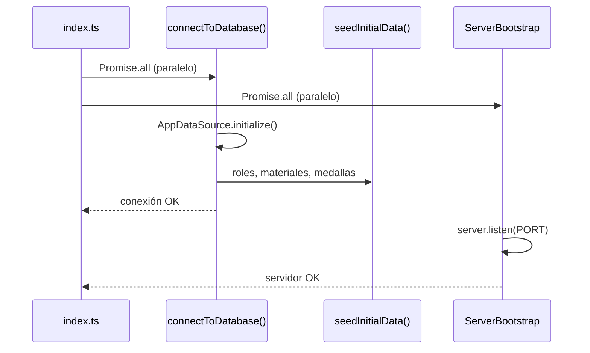
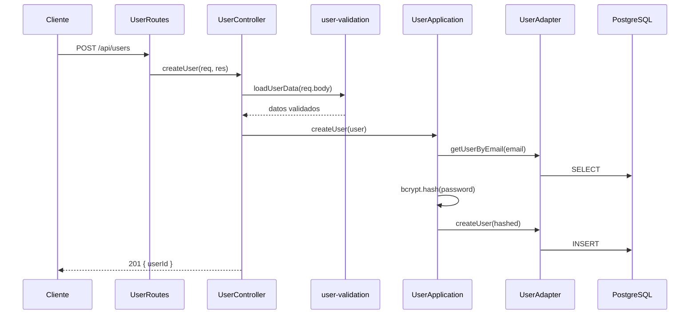
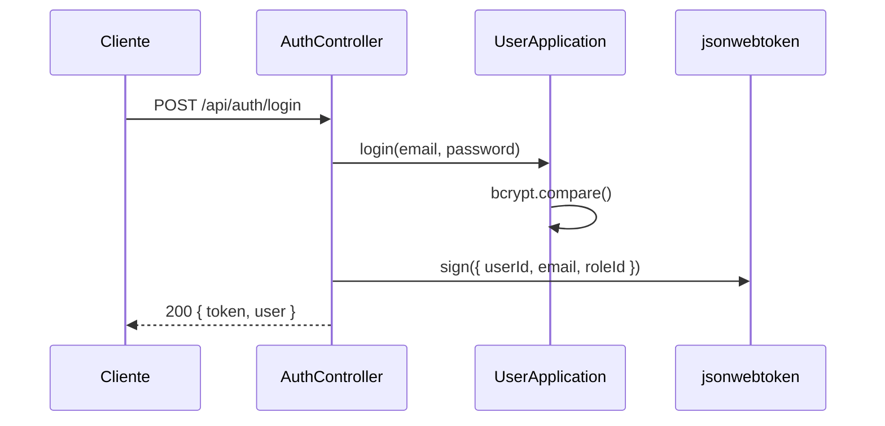
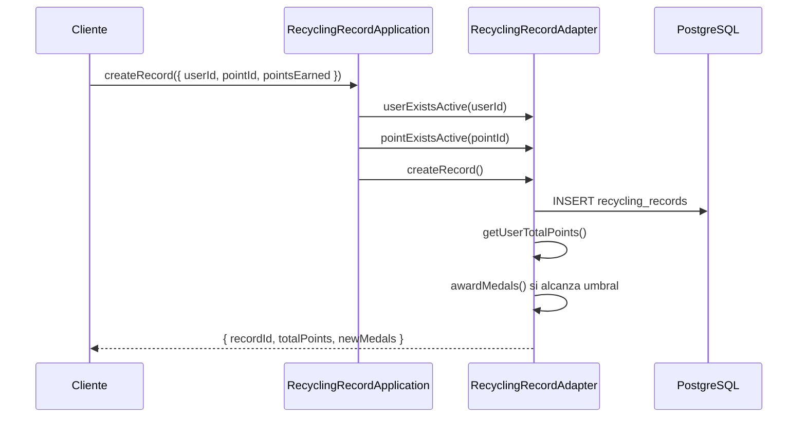

# Arquitectura del Backend — EcoPoint

Este documento describe cómo está organizado el backend de EcoPoint, qué hace cada capa, cómo fluyen las peticiones y qué módulos están implementados.

---

## Patrón de desarrollo: Arquitectura Hexagonal

La aplicación separa **lógica de negocio** de **detalles técnicos** (base de datos, HTTP, frameworks). La comunicación entre capas ocurre mediante **contratos (puertos)** que los **adaptadores** implementan.

```
                    ┌─────────────────────────────────────┐
                    │           HTTP (Express)            │
                    │  routes → controller → util (Joi)   │
                    └──────────────────┬──────────────────┘
                                       │
                    ┌──────────────────▼──────────────────┐
                    │         APPLICATION LAYER           │
                    │   *Application (reglas de negocio)    │
                    └──────────────────┬──────────────────┘
                                       │ usa
                    ┌──────────────────▼──────────────────┐
                    │           DOMAIN LAYER              │
                    │   Interface + *Port (contrato)      │
                    └──────────────────┬──────────────────┘
                                       │ implementa
                    ┌──────────────────▼──────────────────┐
                    │       INFRASTRUCTURE LAYER          │
                    │   *Adapter → TypeORM → PostgreSQL   │
                    └─────────────────────────────────────┘
```

---

## Patrón de diseño: Adapter

Cada módulo tiene un **adaptador** que implementa su puerto y traduce entre el **dominio** y la **entidad TypeORM**.

Ejemplo en `UserAdapter`:

| Método privado | Función |
|----------------|---------|
| `toDomain(entity)` | Columnas `*_user` → propiedades del dominio (`name`, `email`, …) |
| `toEntity(domain)` | Dominio → entidad TypeORM para `save()` |

Los adaptadores son el único lugar que toca TypeORM directamente. Esto permite cambiar la BD sin modificar la lógica de negocio.

---

## Estructura de carpetas

```
src/
├── index.ts
│
├── domain/                           # DOMINIO
│   ├── User.ts, Material.ts, …       # Interfaces del negocio
│   └── port/
│       ├── UserPort.ts
│       ├── MaterialPort.ts
│       ├── RecyclingPointPort.ts
│       ├── MedalPort.ts
│       ├── RecyclingRecordPort.ts
│       └── RolePort.ts
│
├── application/                      # APLICACIÓN
│   ├── UserApplication.ts
│   ├── MaterialApplication.ts
│   ├── RecyclingPointApplication.ts
│   ├── MedalApplication.ts
│   ├── RecyclingRecordApplication.ts
│   └── RoleApplication.ts
│
└── infraestructure/                  # INFRAESTRUCTURA
    ├── adapter/                      # Implementan los puertos
    ├── bootstrap/                    # server.bootstrap.ts
    ├── config/                       # environment-vars.ts, data-base.ts
    ├── controller/                   # Un controller por módulo
    ├── entities/                     # Entidades TypeORM
    ├── middleware/                   # auth.middleware.ts (JWT)
    ├── routes/                       # Rutas REST + cableado de capas
    ├── util/                         # Validaciones Joi por módulo
    └── web/                          # app.ts (Express + CORS)
```

---

## Módulos implementados

| Módulo | Dominio | Application | Adapter | Rutas base |
|--------|---------|-------------|---------|------------|
| Usuarios | `User` | `UserApplication` | `UserAdapter` | `/api/users` |
| Auth (JWT) | — | `UserApplication.login` | — | `/api/auth` |
| Puntos de reciclaje | `RecyclingPoint` | `RecyclingPointApplication` | `RecyclingPointAdapter` | `/api/recycling-points` |
| Materiales | `Material` | `MaterialApplication` | `MaterialAdapter` | `/api/materials` |
| Medallas | `Medal` | `MedalApplication` | `MedalAdapter` | `/api/medals` |
| Registros de reciclaje | `RecyclingRecord` | `RecyclingRecordApplication` | `RecyclingRecordAdapter` | `/api/recycling-records` |
| Roles | `Role` | `RoleApplication` | `RoleAdapter` | `/api/roles` |

Cada módulo CRUD expone: `POST`, `GET` (lista), `GET /id/:id`, `PUT /:id`, `DELETE /:id` con baja lógica.

---

## Responsabilidad de cada capa

### 1. Domain (`domain/`)

Define **qué existe en el negocio** y **qué operaciones** debe soportar el sistema, sin saber cómo se persisten los datos ni cómo llegan las peticiones HTTP.

- **Interfaces** (`User.ts`, `Material.ts`, …): modelos en camelCase.
- **Puertos** (`domain/port/*Port.ts`): contratos que los adaptadores deben cumplir.

### 2. Application (`application/`)

Contiene **reglas de negocio**. No conoce Express ni SQL; solo usa el puerto inyectado.

| Módulo | Reglas principales |
|--------|-------------------|
| `UserApplication` | Email único, hash bcrypt, login con credenciales |
| `RecyclingPointApplication` | Validar que el `materialId` exista y esté activo |
| `MaterialApplication` | Nombre de material único |
| `MedalApplication` | Nombre de medalla único |
| `RecyclingRecordApplication` | Usuario y punto activos, puntos > 0 |
| `RoleApplication` | Nombre de rol único |

### 3. Infrastructure (`infraestructure/`)

Implementa los detalles técnicos:

| Carpeta | Rol |
|---------|-----|
| `adapter/` | Implementa puertos con TypeORM |
| `entities/` | Mapeo a tablas PostgreSQL (schema `public`) |
| `controller/` | Valida entrada HTTP, delega a Application, responde JSON |
| `util/` | Validaciones Joi del body (formato, regex, rangos) |
| `routes/` | Instancia adapter → application → controller |
| `middleware/` | Verifica JWT en rutas protegidas |
| `config/` | Variables de entorno y conexión a PostgreSQL |
| `bootstrap/` | Servidor HTTP con promesas |
| `web/` | Express con `cors()`, `express.json()` y montaje de rutas |

---

## Arranque de la aplicación

Archivo: `src/index.ts`



1. Carga y valida variables de entorno (`environment-vars.ts`).
2. En paralelo con `Promise.all`:
   - Conexión a PostgreSQL (`connectToDatabase`).
   - Servidor HTTP (`ServerBootstrap.initialize`).
3. Tras conectar, inserta datos iniciales si las tablas están vacías (roles, materiales, medallas).
4. Si algo falla → `process.exit(1)`.

---

## Flujo: crear usuario (POST /api/users)



### Capas de validación al crear usuario

| Orden | Capa | Qué valida |
|-------|------|------------|
| 1 | `user-validation.ts` | Nombre, email, password (regex), status, roleId |
| 2 | `UserApplication` | Email no registrado |
| 3 | `UserApplication` | Hash bcrypt antes de guardar |

---

## Flujo: login (POST /api/auth/login)



El endpoint `GET /api/auth/me` usa `authMiddleware` para verificar el token y devolver el perfil sin contraseña.

---

## Flujo: registrar reciclaje (POST /api/recycling-records)



Esta es la **lógica de negocio principal** de gamificación: al reciclar se suman puntos y se otorgan medallas en `user_medals` si el total alcanza `points_required`.

---

## Baja lógica (DELETE)

Ningún módulo borra filas físicamente. El adaptador cambia el campo `status` a `0`:

| Módulo | Campo |
|--------|-------|
| Users | `status_user` |
| Recycling points | `status_point` |
| Materials | `status_material` |
| Medals | `status_medal` |
| Recycling records | `status_record` |
| Roles | `status_role` |

Los `GET` de listado solo devuelven registros con `status = 1`.

---

## Modelo de datos (PostgreSQL)

Schema: `public`. Script completo: `database/schema.sql`.

| Tabla | Descripción |
|-------|-------------|
| `roles` | admin, reciclador |
| `users` | Usuarios con `role_id` FK |
| `auth_sessions` | Sesiones (entidad creada; JWT actual en memoria) |
| `materials` | Tipos de material reciclable |
| `recycling_points` | Puntos en el mapa (lat/lng) |
| `recycling_records` | Historial de reciclaje y puntos |
| `medals` | Catálogo de medallas |
| `user_medals` | Medallas ganadas por usuario |

---

## Cableado de dependencias

Patrón repetido en cada `*Routes.ts`:

```typescript
const adapter = new UserAdapter();
const app = new UserApplication(adapter);
const controller = new UserController(app);

router.post('/users', (req, res) => controller.createUser(req, res));
```

`UserAdapter implements UserPort`, por eso puede inyectarse en `UserApplication` sin acoplar el negocio a TypeORM.

---

## Configuración

`environment-vars.ts` valida al iniciar:

| Variable | Requerida |
|----------|-----------|
| `PORT` | Sí |
| `DB_HOST`, `DB_USER`, `DB_NAME` | Sí |
| `DB_PORT` | Sí (default 5432) |
| `DB_PASSWORD` | Opcional (vacío en local) |
| `JWT_SECRET` | Sí (mín. 10 caracteres) |

`data-base.ts` registra todas las entidades y usa `synchronize: true` solo en desarrollo.

---

## Estado actual

| Requisito proyecto final | Estado |
|--------------------------|--------|
| Arquitectura hexagonal | ✅ |
| 6 CRUD con baja lógica | ✅ |
| JWT + bcrypt | ✅ |
| Validaciones Joi + regex | ✅ |
| Lógica de negocio (puntos/medallas) | ✅ |
| Patrón Adapter | ✅ |
| PostgreSQL | ✅ |

---

## Próximo paso

Integración del **frontend** con login y consumo de al menos dos CRUD (`/auth/login`, `/users`, `/recycling-points`).
