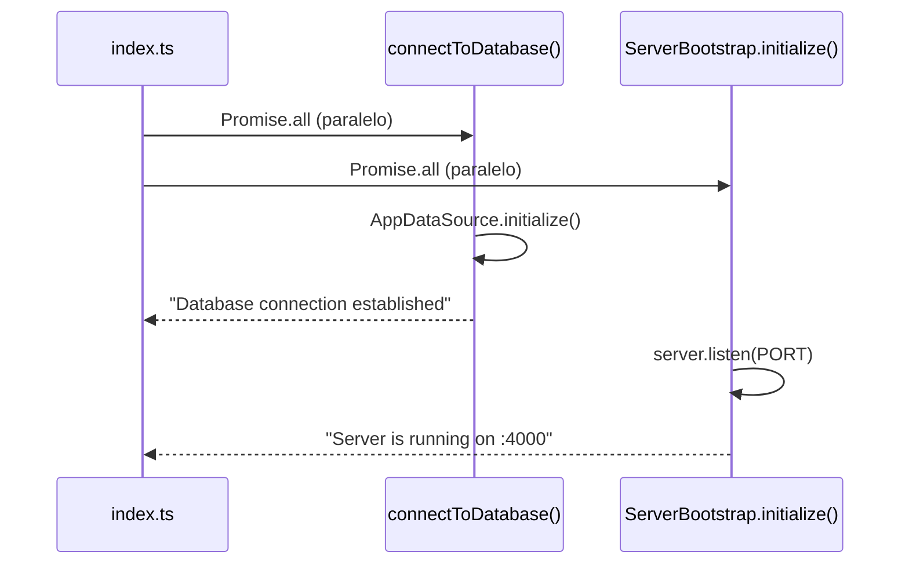
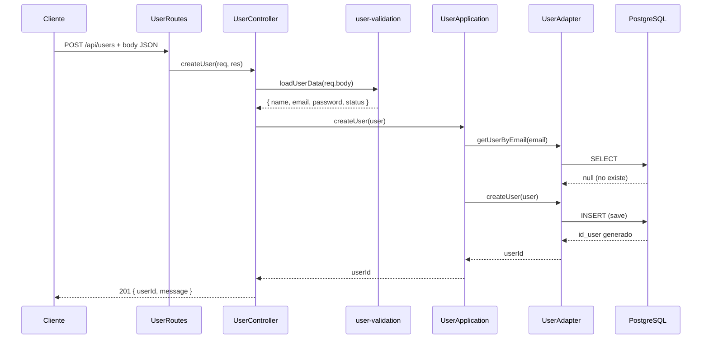
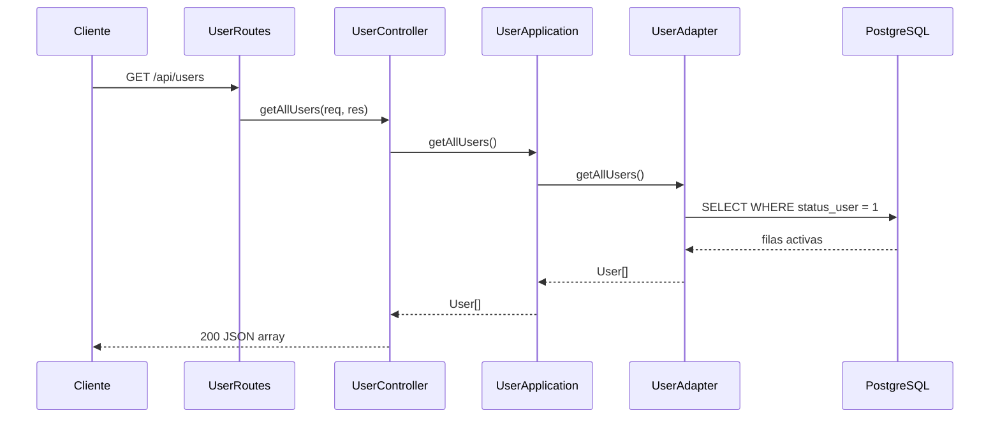

# Arquitectura del Backend — EcoPoint

Este documento describe cómo está organizado el backend de EcoPoint, qué hace cada capa y cómo fluyen las peticiones actualmente.

---

## Patrón: Arquitectura Hexagonal (Puertos y Adaptadores)

La aplicación separa **lógica de negocio** de **detalles técnicos** (base de datos, HTTP, frameworks). La comunicación entre capas ocurre mediante **contratos (puertos)** que los **adaptadores** implementan.

```
                    ┌─────────────────────────────────────┐
                    │           HTTP (Express)            │
                    │   routes → controller → util (Joi)  │
                    └──────────────────┬──────────────────┘
                                       │
                    ┌──────────────────▼──────────────────┐
                    │         APPLICATION LAYER           │
                    │      UserApplication (negocio)      │
                    └──────────────────┬──────────────────┘
                                       │ usa
                    ┌──────────────────▼──────────────────┐
                    │           DOMAIN LAYER              │
                    │   User (interface) + UserPort       │
                    └──────────────────┬──────────────────┘
                                       │ implementa
                    ┌──────────────────▼──────────────────┐
                    │       INFRASTRUCTURE LAYER          │
                    │   UserAdapter → TypeORM → Postgres  │
                    └─────────────────────────────────────┘
```

---

## Estructura de carpetas

```
src/
├── index.ts                          # Arranque: BD + servidor (Promise.all)
│
├── domain/                           # DOMINIO — qué es el negocio
│   ├── User.ts                       # Interface User (modelo de dominio)
│   └── UserPort.ts                   # Contrato: operaciones sobre usuarios
│
├── application/                        # APLICACIÓN — reglas de negocio
│   └── UserApplication.ts            # Valida reglas antes de persistir
│
└── infraestructure/                  # INFRAESTRUCTURA — detalles técnicos
    ├── adapter/
    │   └── UserAdapter.ts            # Implementa UserPort con TypeORM
    ├── bootstrap/
    │   └── server.bootstrap.ts       # Levanta HTTP en el puerto configurado
    ├── config/
    │   ├── environment-vars.ts       # Carga y valida .env con Joi
    │   └── data-base.ts              # DataSource TypeORM + connectToDatabase()
    ├── controller/
    │   └── UserController.ts         # Recibe req/res, valida y delega
    ├── entities/
    │   └── User.ts                   # Entidad TypeORM (tabla en PostgreSQL)
    ├── routes/
    │   └── UserRoutes.ts             # Endpoints REST y cableado de capas
    ├── util/
    │   ├── user-validation.ts        # Joi: crear usuario
    │   ├── user-update-validation.ts # Joi: actualizar usuario (partial)
    │   └── email-validation.ts       # Joi: validar email en consultas
    └── web/
        └── app.ts                    # Express: middlewares + montaje de rutas
```

---

## Responsabilidad de cada capa

### 1. Domain (`domain/`)

Define **qué es un usuario** y **qué operaciones** debe soportar el sistema, sin saber cómo se guardan ni cómo llegan las peticiones.

| Archivo        | Rol |
|----------------|-----|
| `User.ts`      | Interface con `id`, `name`, `email`, `password`, `status` |
| `UserPort.ts`  | Contrato: `createUser`, `updateUser`, `deleteUser`, `getUserById`, `getUserByEmail`, `getAllUsers` |

### 2. Application (`application/`)

Contiene **reglas de negocio**:

| Regla | Dónde |
|-------|-------|
| No registrar email duplicado | `createUser` |
| Usuario debe existir para actualizar | `updateUser` |
| Email en uso por otro usuario al actualizar | `updateUser` |

No conoce Express ni SQL. Solo usa `UserPort`.

### 3. Infrastructure (`infraestructure/`)

Implementa todo lo técnico:

| Módulo | Rol |
|--------|-----|
| **adapter** | `UserAdapter` traduce entre `User` (dominio) y `User` (entidad TypeORM) |
| **entities** | Mapeo a tabla `user` en schema `users` de PostgreSQL |
| **controller** | Valida entrada HTTP, llama a `UserApplication`, responde JSON |
| **util** | Validaciones Joi del body (formato, longitud, regex) |
| **routes** | Instancia adapter → application → controller y define endpoints |
| **config** | Variables de entorno y conexión a PostgreSQL |
| **bootstrap** | Inicialización del servidor con promesas |
| **web** | App Express con `express.json()` y prefijo `/api` |

---

## Arranque de la aplicación

Archivo: `src/index.ts`



1. Carga variables de entorno (`environment-vars.ts` al importarse).
2. Ejecuta en paralelo:
   - Conexión a PostgreSQL (`connectToDatabase`).
   - Servidor HTTP (`ServerBootstrap.initialize`).
3. Si algo falla → `process.exit(1)`.

---

## Flujo: crear usuario (POST /api/users)



### Capas de validación al crear

| Orden | Capa | Qué valida |
|-------|------|------------|
| 1 | `user-validation.ts` (Joi) | Nombre (mín. 3, solo letras), email válido, password (mín. 6, letra+número), status 0 o 1 |
| 2 | `UserApplication` | Email no registrado previamente |
| 3 | `UserAdapter` | Persistencia en BD (unique constraint en email) |

---

## Flujo: listar usuarios (GET /api/users)



Solo devuelve usuarios con `status_user = 1` (activos). Los dados de baja (`status = 0`) no aparecen.

---

## Flujo: buscar por ID (GET /api/users/id/:id)

1. `UserController` convierte `req.params.id` a número.
2. Si no es número válido → **400** `ID invalido`.
3. `UserApplication.getUserById(id)` → `UserAdapter` → `findOne`.
4. Si no existe → **404**.
5. Si existe → **200** con el objeto usuario.

---

## Flujo: buscar por email (GET /api/users/email/:email)

1. `email-validation.ts` valida el parámetro email.
2. `UserApplication.getUserByEmail(email)` → consulta en BD.
3. Si no existe → **404**.
4. Si existe → **200** con el objeto usuario.

---

## Flujo: actualizar usuario (implementado, sin ruta HTTP aún)

Existe en `UserController.updateUser` y `UserApplication.updateUser`, pero **no está registrado en `UserRoutes.ts`**.

```
PUT /api/users/:id  →  (pendiente de registrar)

1. Validar ID numérico
2. loadUpdateUserData(req.body) — Joi partial, mínimo 1 campo
3. UserApplication.updateUser(id, data)
   - Verifica que el usuario exista
   - Si cambia email, verifica que no esté en uso por otro
4. UserAdapter.updateUser — Object.assign + save
5. Respuesta 200 o 404
```

---

## Flujo: eliminar usuario — baja lógica (implementado, sin ruta HTTP aún)

Existe en `UserController.deleteUser`, pero **no está registrado en `UserRoutes.ts`**.

```
DELETE /api/users/:id  →  (pendiente de registrar)

1. Validar ID
2. UserAdapter.deleteUser(id)
3. NO hace DELETE en SQL
4. Cambia status_user a 0
5. El usuario deja de aparecer en getAllUsers
```

---

## Modelo de datos

### Dominio (`domain/User.ts`)

```typescript
interface User {
    id: number;
    name: string;
    email: string;
    password: string;
    status: number;  // 1 = activo, 0 = inactivo
}
```

### Base de datos (`infraestructure/entities/User.ts`)

| Columna TypeORM | Tipo PostgreSQL | Notas |
|-----------------|-----------------|-------|
| `id_user`       | integer (PK, auto) | Generado por la BD |
| `name_user`     | varchar(255)    | |
| `email_user`    | varchar(255)    | UNIQUE |
| `password_user` | varchar(255)    | Texto plano (pendiente hash para producción) |
| `status_user`   | integer         | Default: 1 |

Tabla: `user` en schema `users` (configurado en `data-base.ts`).

### Transformación Domain ↔ Entity

`UserAdapter` tiene dos métodos privados:

- `toDomain(entity)` → convierte columnas `*_user` a propiedades del dominio.
- `toEntity(domain)` → convierte dominio a entidad TypeORM para guardar.

---

## Cableado de dependencias

En `UserRoutes.ts` se instancian las capas de abajo hacia arriba:

```typescript
const userAdapter = new UserAdapter();           // infraestructura
const userApp = new UserApplication(userAdapter); // recibe el puerto
const userController = new UserController(userApp); // recibe application
```

`UserAdapter` implementa `UserPort`, por eso puede inyectarse en `UserApplication`.

---

## Configuración y variables de entorno

`environment-vars.ts` carga `.env` y valida con Joi al iniciar:

- Si falta una variable requerida → la app no arranca.
- `DB_PASSWORD` puede estar vacío (desarrollo local).
- `DB_PORT` por defecto en Joi: `3306` (convendría cambiar a `5432` para PostgreSQL).

`data-base.ts` crea el `DataSource` de TypeORM con `synchronize: true` en desarrollo.

---

## Estado actual del módulo de usuarios

| Funcionalidad | Application | Adapter | Controller | Ruta HTTP |
|---------------|:-----------:|:-------:|:----------:|:---------:|
| Crear usuario | ✅ | ✅ | ✅ | ✅ `POST /users` |
| Listar activos | ✅ | ✅ | ✅ | ✅ `GET /users` |
| Buscar por ID | ✅ | ✅ | ✅ | ✅ `GET /users/id/:id` |
| Buscar por email | ✅ | ✅ | ✅ | ✅ `GET /users/email/:email` |
| Actualizar | ✅ | ✅ | ✅ | ❌ pendiente |
| Baja lógica | ✅ | ✅ | ✅ | ❌ pendiente |

---

## Próximos módulos (EcoPoint)

El mismo patrón se replicará para:

- Puntos de reciclaje (`RecyclingPointPort`, adapter, controller, routes)
- Gamificación (puntos, medallas, ranking)
- Autenticación JWT (entregable final del curso)

Cada módulo nuevo = carpeta en `domain/`, clase en `application/`, adapter + controller + routes en `infraestructure/`.
