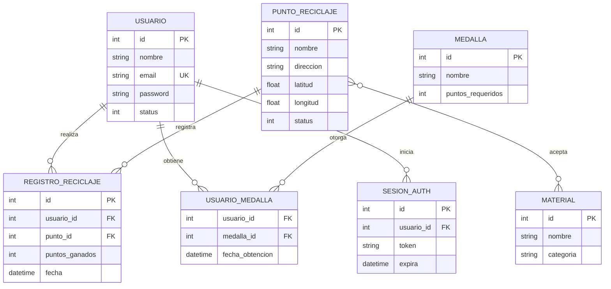
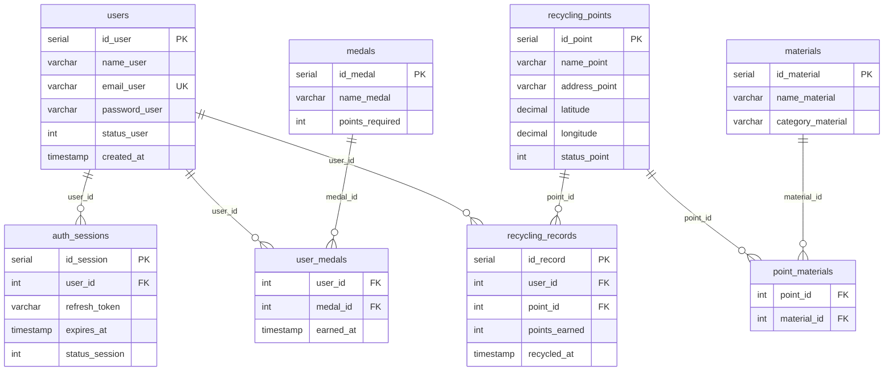
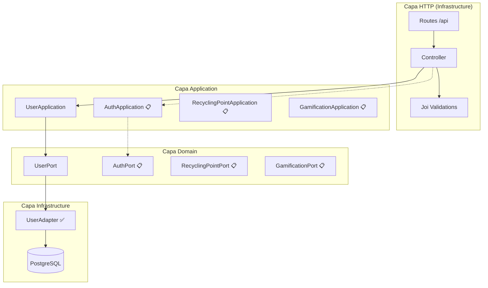
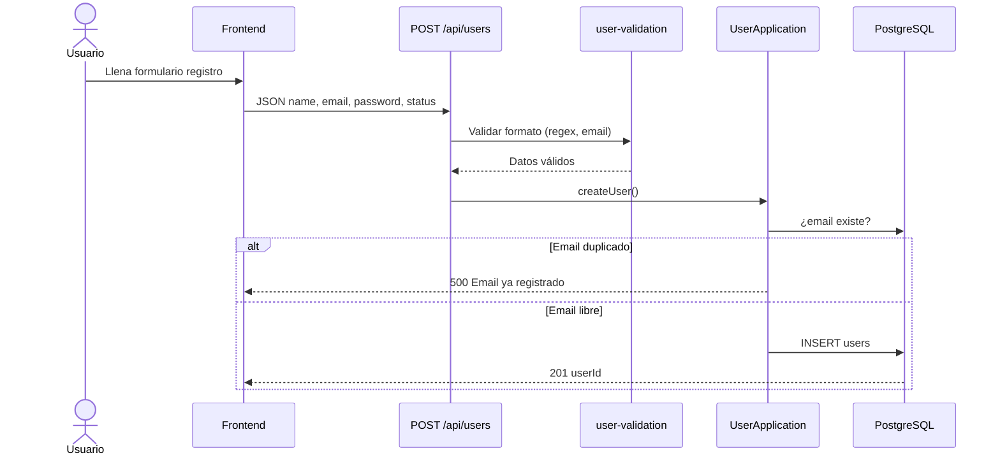
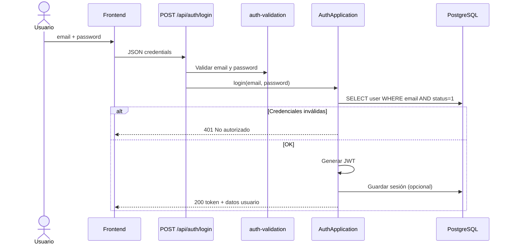
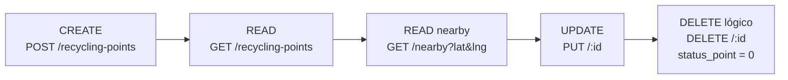

# EcoPoint — Diagramas para la 2.ª Entrega

**Proyecto:** EcoPoint — Recicla con Propósito  
**ODS:** 11 (Ciudades sostenibles) + 12 (Producción y consumo responsables)  
**Stack backend:** Node.js, Express, TypeScript, PostgreSQL, Arquitectura Hexagonal

---

## Leyenda de estado

| Símbolo | Significado |
|---------|-------------|
| ✅ | Implementado en el código actual |
| 🔶 | Parcialmente implementado |
| 📋 | Diseñado / pendiente (proyecto final) |

---

## 1. Diagrama conceptual (Entidad-Relación)

Modelo de alto nivel: **qué existe en el negocio** y cómo se relaciona.



---

## 2. Diagrama lógico (Modelo relacional)

Modelo técnico con **tablas, claves y cardinalidades**.



### Tabla resumen lógica

| Tabla | Descripción | Estado |
|-------|-------------|--------|
| `users` | Registro y login de usuarios | ✅ Implementada |
| `auth_sessions` | Tokens JWT / sesiones | 📋 Pendiente |
| `recycling_points` | Puntos de reciclaje en el mapa | 📋 Pendiente |
| `materials` | Tipos de material reciclable | 📋 Pendiente |
| `point_materials` | Materiales por punto (N:M) | 📋 Pendiente |
| `recycling_records` | Historial y puntos por reciclaje | 📋 Pendiente |
| `medals` | Medallas de gamificación | 📋 Pendiente |
| `user_medals` | Medallas obtenidas por usuario | 📋 Pendiente |

---

## 3. Diagrama físico (PostgreSQL)

Script SQL para la **2.ª entrega** (mínimo) y extensión planificada.

### 3.1 Tabla implementada hoy — `users`

```sql
-- Base de datos
CREATE DATABASE ecopoint_db;

-- Schema (opcional; en código actual: schema "users")
CREATE SCHEMA IF NOT EXISTS users;

CREATE TABLE users."user" (
    id_user       SERIAL PRIMARY KEY,
    name_user     VARCHAR(255) NOT NULL,
    email_user    VARCHAR(255) NOT NULL UNIQUE,
    password_user VARCHAR(255) NOT NULL,
    status_user   INTEGER NOT NULL DEFAULT 1,
    created_at    TIMESTAMP DEFAULT CURRENT_TIMESTAMP
);

-- status_user: 1 = activo, 0 = baja lógica (no borrado físico)
```

### 3.2 Tablas planificadas — login y módulos EcoPoint

```sql
-- AUTH / LOGIN (JWT)
CREATE TABLE users.auth_sessions (
    id_session      SERIAL PRIMARY KEY,
    user_id         INTEGER NOT NULL REFERENCES users."user"(id_user),
    refresh_token   VARCHAR(500),
    expires_at      TIMESTAMP NOT NULL,
    status_session  INTEGER DEFAULT 1
);

-- PUNTOS DE RECICLAJE (mapa)
CREATE TABLE public.recycling_points (
    id_point        SERIAL PRIMARY KEY,
    name_point      VARCHAR(255) NOT NULL,
    address_point   VARCHAR(500),
    latitude        DECIMAL(10, 8) NOT NULL,
    longitude       DECIMAL(11, 8) NOT NULL,
    status_point    INTEGER DEFAULT 1
);

-- MATERIALES
CREATE TABLE public.materials (
    id_material       SERIAL PRIMARY KEY,
    name_material     VARCHAR(100) NOT NULL,
    category_material VARCHAR(100)
);

CREATE TABLE public.point_materials (
    point_id    INTEGER REFERENCES public.recycling_points(id_point),
    material_id INTEGER REFERENCES public.materials(id_material),
    PRIMARY KEY (point_id, material_id)
);

-- GAMIFICACIÓN
CREATE TABLE public.recycling_records (
    id_record     SERIAL PRIMARY KEY,
    user_id       INTEGER NOT NULL REFERENCES users."user"(id_user),
    point_id      INTEGER NOT NULL REFERENCES public.recycling_points(id_point),
    points_earned INTEGER NOT NULL DEFAULT 0,
    recycled_at   TIMESTAMP DEFAULT CURRENT_TIMESTAMP
);

CREATE TABLE public.medals (
    id_medal         SERIAL PRIMARY KEY,
    name_medal       VARCHAR(100) NOT NULL,
    points_required  INTEGER NOT NULL
);

CREATE TABLE public.user_medals (
    user_id    INTEGER REFERENCES users."user"(id_user),
    medal_id   INTEGER REFERENCES public.medals(id_medal),
    earned_at  TIMESTAMP DEFAULT CURRENT_TIMESTAMP,
    PRIMARY KEY (user_id, medal_id)
);
```

---

## 4. Arquitectura hexagonal del backend



---

## 5. CRUD por módulo — Matriz completa EcoPoint

### 5.1 Usuarios y Login (Auth)

| Operación | Endpoint propuesto | Método | Baja lógica | Estado |
|-----------|-------------------|--------|-------------|--------|
| **C**rear / Registro | `/api/users` | POST | — | ✅ |
| **R**ead — listar | `/api/users` | GET | Solo `status=1` | ✅ |
| **R**ead — por ID | `/api/users/id/:id` | GET | — | ✅ |
| **R**ead — por email | `/api/users/email/:email` | GET | — | ✅ |
| **U**pdate | `/api/users/:id` | PUT | — | 🔶 Controller sí, ruta no |
| **D**elete lógico | `/api/users/:id` | DELETE | `status_user = 0` | 🔶 Controller sí, ruta no |
| **Login** | `/api/auth/login` | POST | — | 📋 JWT pendiente |
| **Perfil** | `/api/auth/me` | GET | — | 📋 JWT pendiente |

### 5.2 Puntos de reciclaje (Mapa)

| Operación | Endpoint | Método | Baja lógica | Estado |
|-----------|----------|--------|-------------|--------|
| **C**rear punto | `/api/recycling-points` | POST | — | 📋 |
| **R**ead — todos | `/api/recycling-points` | GET | Solo activos | 📋 |
| **R**ead — por ID | `/api/recycling-points/:id` | GET | — | 📋 |
| **R**ead — cercanos | `/api/recycling-points/nearby` | GET | Por lat/lng | 📋 |
| **U**pdate | `/api/recycling-points/:id` | PUT | — | 📋 |
| **D**elete lógico | `/api/recycling-points/:id` | DELETE | `status_point = 0` | 📋 |

### 5.3 Gamificación (Puntos y medallas)

| Operación | Endpoint | Método | Baja lógica | Estado |
|-----------|----------|--------|-------------|--------|
| **C**rear registro reciclaje | `/api/recycling-records` | POST | Suma puntos | 📋 |
| **R**ead — puntos usuario | `/api/users/:id/points` | GET | — | 📋 |
| **R**ead — ranking | `/api/leaderboard` | GET | Top recicladores | 📋 |
| **R**ead — medallas | `/api/medals` | GET | — | 📋 |
| **U**pdate medalla usuario | `/api/users/:id/medals` | PUT | — | 📋 |
| **D**elete lógico registro | `/api/recycling-records/:id` | DELETE | Anular registro | 📋 |

> **Nota entrega 2:** Solo se exige **estructura + conexión BD + diseño**. Los 6 CRUD completos son del **proyecto final**. Para la 2.ª entrega documenta todos los módulos y muestra `users` implementado.

---

## 6. Flujo CRUD — Registro de usuario (implementado)



---

## 7. Flujo CRUD — Login (planificado)



---

## 8. Flujo CRUD — Puntos de reciclaje (planificado)



---

## 9. Arranque del backend (entrega 2)

```mermaid
flowchart TD
    A[index.ts] --> B[Promise.all]
    B --> C[connectToDatabase]
    B --> D[ServerBootstrap.initialize]
    C --> E[(PostgreSQL ecopoint_db)]
    D --> F[Servidor :4000]
    E --> G[Tabla users.user]
    F --> H[/api/users ...]
```

---

## 10. Qué incluir en el PDF de Moodle

Para la **2.ª entrega**, tu documento debería tener al menos:

1. **Diagrama conceptual** (sección 1)
2. **Diagrama lógico** (sección 2)
3. **Script físico** — mínimo tabla `users` (sección 3.1)
4. **Arquitectura hexagonal** (sección 4)
5. **Matriz CRUD** — usuarios/login + otros módulos (sección 5)
6. **Flujo de registro** implementado (sección 6)
7. Artefactos Scrum (HU, Backlog, Sprint) — documento aparte

---

## Cómo exportar estos diagramas

1. Copia el código `mermaid` en [mermaid.live](https://mermaid.live) y exporta como PNG/SVG.
2. O pégalo en Word/Google Docs con un plugin Mermaid.
3. O usa draw.io / Lucidchart recreando las tablas del diagrama lógico.
