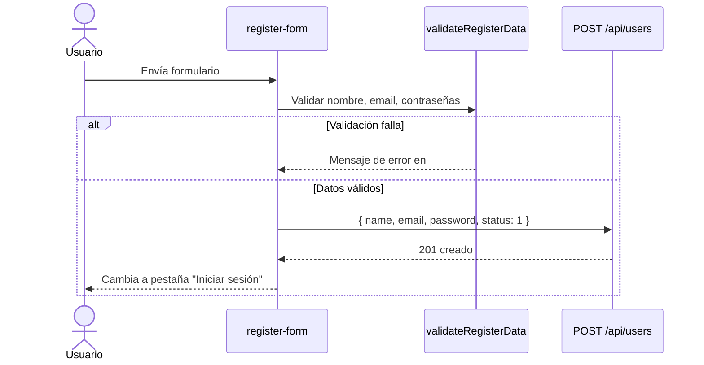
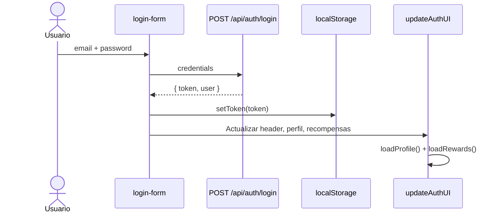
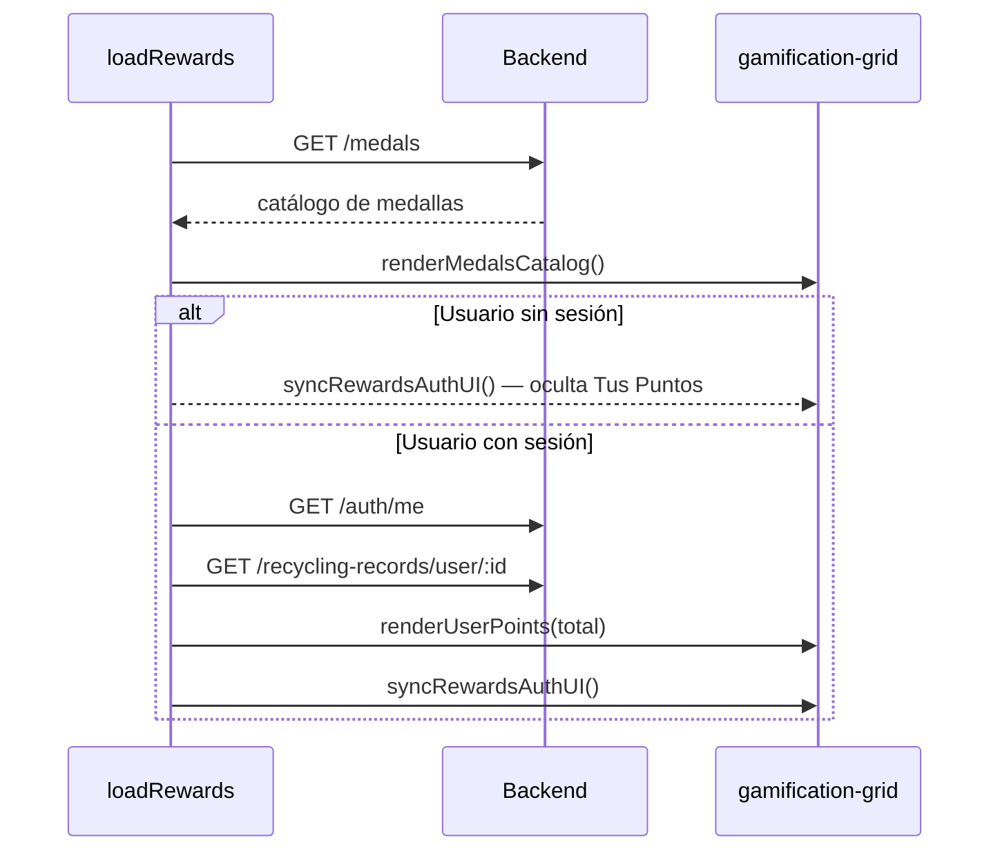

# Arquitectura del Frontend — EcoPoint

Este documento describe cómo está organizado el frontend de EcoPoint, la separación de responsabilidades entre archivos, el flujo de datos con el backend y el comportamiento según el estado de autenticación.

---

## Enfoque general

El frontend es una **Single Page Application (SPA) ligera** sin framework (React, Angular, Vue). Toda la navegación ocurre con **anclas hash** (`#mapa`, `#guia`, `#comunidad`, etc.) sobre un único archivo HTML.

La lógica se organiza en **módulos JavaScript por dominio funcional**, cargados en orden fijo al final del documento. No hay bundler ni sistema de módulos ES6 (`import`/`export`); las funciones globales se invocan desde el HTML y entre archivos por convención de nombres.

```
┌─────────────────────────────────────────────────────────────┐
│              proyecto ecopoint.html (vista)                 │
│   header · secciones · formularios · contenedores dinámicos │
└───────────────────────────┬─────────────────────────────────┘
                            │ DOM + eventos
        ┌───────────────────┼───────────────────┐
        ▼                   ▼                   ▼
   ┌─────────┐        ┌──────────┐        ┌───────────┐
   │ auth.js │        │points.js │        │rewards.js │
   └────┬────┘        └────┬─────┘        └─────┬─────┘
        │                  │                    │
        └──────────────────┼────────────────────┘
                           ▼
                    ┌─────────────┐
                    │   api.js    │  ← cliente HTTP + JWT
                    └──────┬──────┘
                           ▼
                    ┌─────────────┐
                    │  config.js  │  ← API_BASE, AUTH_TOKEN_KEY
                    └──────┬──────┘
                           ▼
              Backend REST (localhost:4000/api)
```

---

## Estructura de carpetas

```
frontend/
├── proyecto ecopoint.html    # Vista única: markup + scripts inline (guía, breadcrumbs)
├── css/
│   └── style.css             # Estilos por componente/sección
├── js/
│   ├── config.js             # Configuración global
│   ├── api.js                # Capa de transporte HTTP
│   ├── auth.js               # Autenticación y UI de sesión
│   ├── points.js             # Módulo mapa / puntos de reciclaje
│   └── rewards.js            # Módulo gamificación
└── assets/img/               # Recursos estáticos
```

---

## Orden de carga de scripts

El orden es **obligatorio** por dependencias entre archivos:

| Orden | Archivo | Depende de |
|-------|---------|------------|
| 1 | `config.js` | — |
| 2 | `api.js` | `config.js` (`API_BASE`, `AUTH_TOKEN_KEY`) |
| 3 | `auth.js` | `api.js` (`apiRequest`, `isLoggedIn`, …) |
| 4 | `points.js` | `api.js` |
| 5 | `rewards.js` | `api.js`, `auth.js` (`syncRewardsAuthUI`, `isLoggedIn`) |

Inicialización en `DOMContentLoaded`:

```javascript
initAuth();
initPoints();
initRewards();
```

---

## Capas y responsabilidades

### 1. Configuración (`config.js`)

Constantes globales compartidas por todos los módulos:

| Constante | Valor | Uso |
|-----------|-------|-----|
| `API_BASE` | `http://localhost:4000/api` | Prefijo de todas las peticiones |
| `AUTH_TOKEN_KEY` | `ecopoint_token` | Clave en `localStorage` |

---

### 2. Capa de API (`api.js`)

Cliente HTTP centralizado. Todos los módulos consumen el backend **solo** a través de `apiRequest()`.

| Función | Responsabilidad |
|---------|-----------------|
| `getToken()` / `setToken()` / `clearToken()` | Persistencia del JWT en `localStorage` |
| `isLoggedIn()` | Indica si hay token guardado |
| `apiRequest(path, options)` | `fetch` con JSON, header `Authorization` automático y manejo de errores |

**Contrato de error:** si `response.ok` es falso, lanza `Error` con `data.error` o `data.message` del backend.

---

### 3. Módulo de autenticación (`auth.js`)

Gestiona login, registro, perfil y el estado visual de la sesión.

| Función | Responsabilidad |
|---------|-----------------|
| `initAuth()` | Punto de entrada: tabs, formularios, botón logout, `updateAuthUI()` |
| `initLoginForm()` | `POST /auth/login` → guarda token |
| `initRegisterForm()` | Valida en cliente → `POST /users` |
| `validateRegisterData()` | Reglas de registro (email `.com`, confirmar contraseña, etc.) |
| `loadProfile()` | `GET /auth/me` → renderiza `#profile-info` |
| `updateAuthUI()` | Alterna paneles auth/perfil y botón del header |
| `syncRewardsAuthUI()` | Oculta/muestra nav perfil y tarjeta de puntos según sesión |

#### Estado de la UI según sesión

| Elemento | Sin sesión | Con sesión |
|----------|------------|------------|
| `#auth-btn` | "Login / Registro" | "Cerrar sesión" |
| `#nav-profile` | `hidden` | visible |
| `#auth-panel` | visible | `hidden` |
| `#profile-panel` | `hidden` | visible |
| `#user-points-card` | `hidden` | visible |
| `#gamification-grid` | clase `is-guest` (2 columnas) | sin clase (3 columnas) |

---

### 4. Módulo de puntos de reciclaje (`points.js`)

| Función | Responsabilidad |
|---------|-----------------|
| `loadRecyclingPoints()` | `GET /recycling-points` → renderiza tarjetas en `#points-list` |
| `initPoints()` | Ejecuta la carga al arrancar la página |

Los datos se inyectan en el DOM con `createElement` + `innerHTML` por cada punto.

---

### 5. Módulo de recompensas (`rewards.js`)

| Función | Responsabilidad |
|---------|-----------------|
| `loadRewards()` | Orquesta carga de medallas y puntos del usuario |
| `renderMedalsCatalog(medals)` | Pinta el grid `#medals-grid` desde `GET /medals` |
| `renderUserPoints(total, medals)` | Actualiza total, barra de progreso y texto hacia la próxima medalla |
| `syncRewardsAuthUI()` | Reafirma visibilidad tras peticiones async (evita condiciones de carrera) |

**Cálculo de puntos del usuario:** suma `pointsEarned` de todos los registros devueltos por `GET /recycling-records/user/:userId`.

**Barra de progreso:** compara el total del usuario con el `pointsRequired` de la siguiente medalla del catálogo ordenado.

---

## Scripts inline en el HTML

Parte de la lógica vive directamente en `proyecto ecopoint.html` (no en `js/`):

| Bloque | Responsabilidad |
|--------|-----------------|
| Breadcrumbs | Actualiza migas de pan según `window.location.hash` |
| Modal de guía | Abre/cierra tarjetas educativas de la sección `#guia` |
| `DOMContentLoaded` | Llama a `initAuth`, `initPoints`, `initRewards` |

Estos bloques son **puramente de UI** y no consumen la API.

---

## Flujo: registro de usuario



---

## Flujo: inicio de sesión



---

## Flujo: carga de recompensas



---

## Mapa de endpoints consumidos

| Módulo | Endpoint | Cuándo se llama |
|--------|----------|-----------------|
| `auth.js` | `POST /users` | Submit de registro |
| `auth.js` | `POST /auth/login` | Submit de login |
| `auth.js` | `GET /auth/me` | Tras login y al cargar perfil |
| `points.js` | `GET /recycling-points` | Al cargar la página |
| `rewards.js` | `GET /medals` | Al cargar la página y tras login |
| `rewards.js` | `GET /recycling-records/user/:id` | Solo con sesión activa |

---

## Estilos (`css/style.css`)

Organización por secciones del HTML:

| Bloque CSS | Sección |
|------------|---------|
| `header`, `nav`, `.auth-btn` | Cabecera fija |
| `.hero` | Portada |
| `.map-section`, `.points-list` | Mapa y listado API |
| `.guide`, `.guide-modal` | Guía educativa |
| `.gamification`, `.reward-card` | Sistema de recompensas |
| `.form-section`, `.auth-panel` | Login y registro |
| `.impact-section` | ODS |
| `@media` | Responsive (1100px, 640px) |

Reglas relevantes para autenticación:

```css
#user-points-card[hidden],
.gamification-grid.is-guest #user-points-card {
    display: none !important;
}
```

Evita que `display: flex` de `.points-card` anule el atributo `hidden`.

---

## Contenido estático vs. dinámico

| Componente | Origen de datos |
|------------|-----------------|
| Lista de puntos de reciclaje | API (`/recycling-points`) |
| Catálogo de medallas | API (`/medals`) |
| Tus Puntos (total y progreso) | API (`/auth/me` + `/recycling-records/user/:id`) |
| Perfil de usuario | API (`/auth/me`) |
| Top Recicladores | HTML estático (mock) |
| Mapa iframe | Google Maps embebido |
| Guía de reciclaje | Texto en atributos `data-guide-*` del HTML |
| Filtros del mapa | UI estática (sin filtrado API aún) |

---

## Seguridad en el cliente

| Aspecto | Implementación |
|---------|----------------|
| Token JWT | `localStorage` bajo `ecopoint_token` |
| Envío del token | Header `Authorization: Bearer` en `apiRequest` |
| Token inválido | `loadProfile` hace `clearToken()` y `updateAuthUI()` |
| Validación de registro | Cliente antes de enviar; el backend valida de nuevo con Joi |
| Contraseñas | Nunca se almacenan en el frontend, solo se envían en POST |

> La seguridad real (hash bcrypt, firma JWT, reglas de negocio) está en el **backend**. El frontend valida UX y reduce peticiones inválidas.

---

## Estado actual

| Requisito proyecto final | Estado |
|--------------------------|--------|
| Frontend con login | ✅ |
| Consumo de ≥ 2 CRUD desde la API | ✅ (users, recycling-points, medals, recycling-records) |
| Validaciones en formularios | ✅ (registro) |
| UI según estado de sesión | ✅ |
| Integración JWT | ✅ |
| Ranking dinámico | 📋 Pendiente (datos estáticos) |
| Mapa con marcadores por punto API | 📋 Pendiente (solo iframe + lista) |

---

## Próximos pasos sugeridos

1. Endpoint `GET /api/leaderboard` y conectar **Top Recicladores**.
2. Filtrar `#points-list` por material usando `GET /materials`.
3. Formulario en el front para `POST /recycling-records` (demostrar lógica de negocio en vivo).
4. Mover scripts inline (breadcrumbs, modal) a archivos en `js/` para uniformidad.
